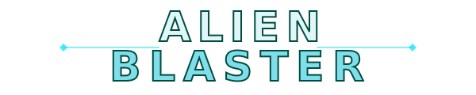
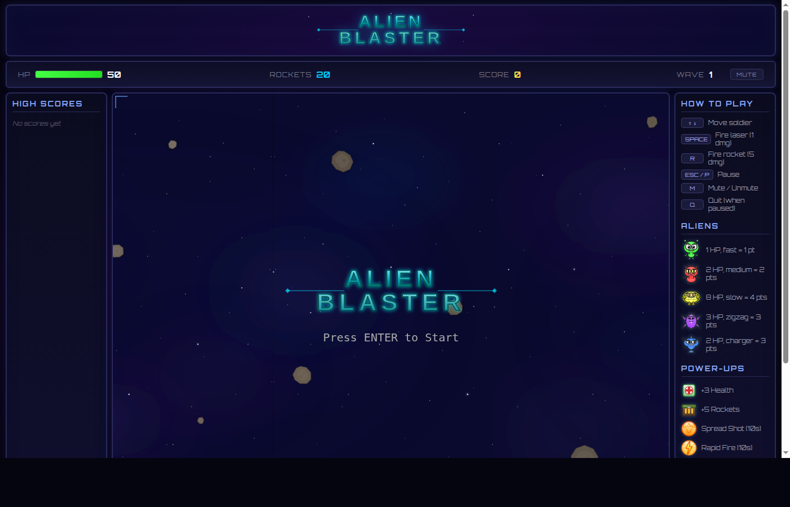

<p align="center">
  
</p>

<p align="center">
  <strong>A side-scrolling space shooter built with HTML5 Canvas and vanilla JavaScript.</strong><br>
  Defend against waves of aliens, fight bosses, collect power-ups, and climb the global leaderboard.
</p>

<p align="center">
  <a href="https://32gamers.com/AlienBlaster/">Play Now</a>
  &nbsp;&bull;&nbsp;
  <a href="#controls">Controls</a>
  &nbsp;&bull;&nbsp;
  <a href="#architecture">Architecture</a>
  &nbsp;&bull;&nbsp;
  <a href="#setup">Setup</a>
</p>

<p align="center">
  
  
  
  
  
</p>

---

<p align="center">
  
</p>

## Features

- 5 alien types with unique movement behaviors
- Boss fights every 5 waves with escalating difficulty
- 6 collectible power-ups (weapons, shield, speed boost)
- Procedural retro sound effects (no audio files)
- Parallax scrolling starfield with particle effects
- Screen shake, score pop-ups, and visual juice
- Global leaderboard via MySQL API
- Sci-fi themed UI with live stats bar and side panels
- Zero dependencies, zero build tools

---

## Controls

| Key | Action |
|-----|--------|
| `Arrow Up / Down` | Move soldier |
| `Space` | Fire laser (1 dmg, unlimited) |
| `R` | Fire rocket (5 dmg, limited ammo) |
| `ESC / P` | Pause |
| `Q` | Quit game (when paused) |
| `M` | Mute / Unmute |
| `Enter` | Start, advance waves, submit score |

---

## Aliens

<table>
<tr>
<td align="center"><br><strong>Green</strong><br>1 HP &bull; Fast<br>1 point</td>
<td align="center"><br><strong>Red</strong><br>2 HP &bull; Medium<br>2 points</td>
<td align="center"><br><strong>Yellow</strong><br>8 HP &bull; Slow<br>4 points</td>
<td align="center"><br><strong>Purple</strong><br>3 HP &bull; Zigzag<br>3 points</td>
<td align="center"><br><strong>Blue</strong><br>2 HP &bull; Charger<br>3 points</td>
<td align="center"><br><strong>Boss</strong><br>45+ HP &bull; 2 Phases<br>20+ points</td>
</tr>
</table>

### Boss Fights

Bosses appear every 5 waves, each harder than the last:

- **Phase 1** &mdash; Bounces vertically, spawns minion aliens
- **Phase 2** (below 50% HP) &mdash; Faster movement, fires projectiles at the player
- Health, speed, fire rate, and damage all scale per boss appearance
- Defeating a boss drops a guaranteed weapon upgrade

---

## Power-Ups

Power-ups spawn every 5 kills and drop guaranteed from bosses.

<table>
<tr>
<td align="center"><br><strong>Health</strong><br>+3 HP</td>
<td align="center"><br><strong>Ammo</strong><br>+5 Rockets</td>
<td align="center"><br><strong>Spread</strong><br>3 lasers, 10s</td>
<td align="center"><br><strong>Rapid Fire</strong><br>2x rate, 10s</td>
<td align="center"><br><strong>Shield</strong><br>3 hits</td>
<td align="center"><br><strong>Speed</strong><br>1.8x move, 6.5s</td>
</tr>
</table>

---

## Difficulty Scaling

The game gets harder every wave:

| Mechanic | Scaling |
|----------|---------|
| Aliens per wave | 12 base + 3 per wave |
| Alien speed | +4% per wave |
| Spawn rate | 1.4s &rarr; 0.35s floor |
| Purple aliens | Wave 6+ |
| Blue chargers | Wave 8+ |
| Bosses | Every 5 waves, scaling stats |
| Late game (15+) | Mostly tanks, zigzags, chargers |

---

## Architecture

22 source files following an entity-system pattern with centralized configuration.

```
src/
  main.js                  Entry point, asset manifest, audio init
  config/
    gameConfig.js          All tunable constants (no magic numbers)

  engine/                  Core systems
    Game.js                Game loop, state machine, system orchestration
    AssetManager.js        SVG preloading with progress bar
    AudioManager.js        Web Audio API, volume/mute persistence
    Background.js          3-layer parallax scrolling
    Camera.js              Screen shake with intensity decay
    InputManager.js        Keyboard state (held + single-frame press)
    ParticleSystem.js      Particle emitter: explosions, trails, flash, sparkle
    SoundGenerator.js      Procedural retro SFX via oscillator synthesis

  entities/                Game objects
    Entity.js              Base class: position, velocity, hitbox, update, render
    Soldier.js             Player: movement, weapons, shields, upgrades, HP bar
    Alien.js               5 types with unique behaviors (charge, zigzag, tank)
    BossAlien.js           2-phase boss with per-appearance scaling
    Projectile.js          Laser and rocket
    PowerUp.js             6 types with weighted random + bobbing animation

  systems/                 Game logic
    CollisionSystem.js     AABB: projectile/alien, alien/soldier, powerup/soldier
    WaveManager.js         Wave progression, spawn timing, type distribution
    ScoreManager.js        API client with localStorage fallback

  ui/                      Presentation
    HUD.js                 Canvas overlay: upgrade timers, controls hint
    ScorePopup.js          Floating "+N" text on kills
    GameOverScreen.js      Name entry, high scores table

api/                       Backend
  scores.php               GET top 20 / POST score (upsert if higher)
  config.php               DB credentials (gitignored)
  config.example.php       Template for deployment

assets/images/             21 SVG sprites
index.html                 Page layout with stats bar and side panels
styles.css                 Sci-fi theme (Orbitron font, gradients, glow)
```

### Design Highlights

| Concept | Approach |
|---------|----------|
| **Frame-rate independence** | All movement uses `velocity * deltaTime` |
| **State machine** | 6 states eliminate boolean flag soup |
| **Collision** | Centralized AABB with reverse-iteration splice |
| **Config-driven** | All tuning in one file, no magic numbers |
| **Procedural audio** | 10 SFX generated from oscillators, zero audio files |
| **Asset fallbacks** | Every sprite has a colored-rectangle fallback |
| **Offline support** | Scores cached in localStorage when API unreachable |

---

## Tech Stack

| Layer | Technology |
|-------|-----------|
| Rendering | HTML5 Canvas 2D (1200x800) |
| Language | Vanilla JavaScript (ES modules, classes) |
| Audio | Web Audio API (procedural synthesis) |
| Art | 21 hand-crafted SVG sprites |
| Styling | CSS3 with Orbitron font |
| Backend | PHP + MySQL (global leaderboard) |
| Hosting | Static files on iFastNet |
| Build tools | None |
| Frameworks | None |

---

## Setup

### Local Development

```bash
git clone https://github.com/smkun/AlienBlaster2.0.git
cd AlienBlaster2.0
# Open with VS Code Live Server, or:
python3 -m http.server 8080
# Visit http://localhost:8080
```

No build step. No `npm install`. It just works.

### Deployment (PHP host)

1. Upload all files to your web host
2. Copy `api/config.example.php` to `api/config.php`
3. Fill in your MySQL credentials
4. Create the table:

```sql
CREATE TABLE high_scores (
    id INT AUTO_INCREMENT PRIMARY KEY,
    name VARCHAR(10) NOT NULL UNIQUE,
    score INT NOT NULL DEFAULT 0,
    wave INT NOT NULL DEFAULT 1,
    updated_at TIMESTAMP DEFAULT CURRENT_TIMESTAMP ON UPDATE CURRENT_TIMESTAMP
);
```

No database? No problem &mdash; scores save to localStorage instead.

---

## Credits

Built with [Claude Code](https://claude.ai/claude-code) by Anthropic.

Original concept: [Alien Blaster v1](https://github.com/smkun/alien-blaster-project)
